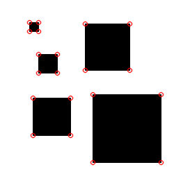
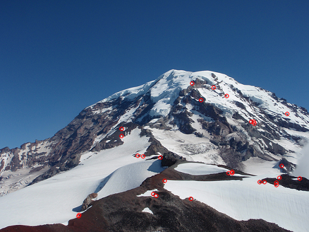
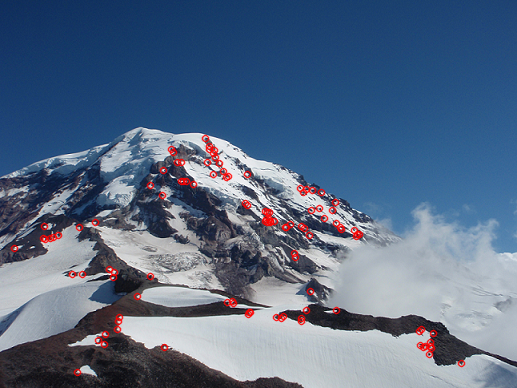
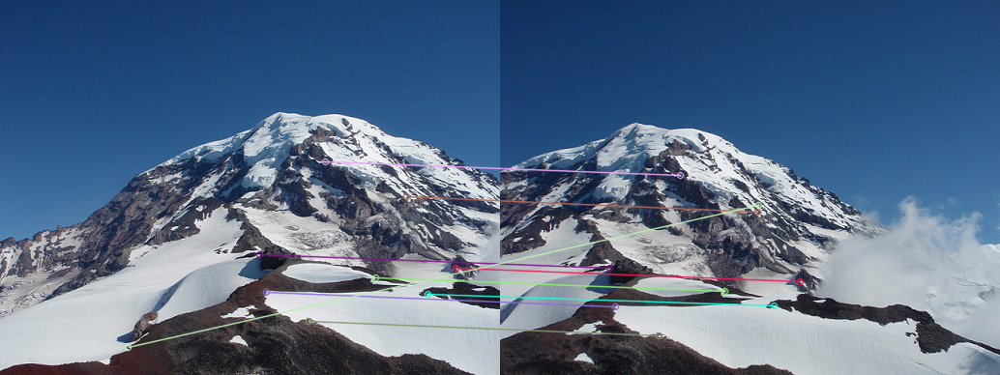
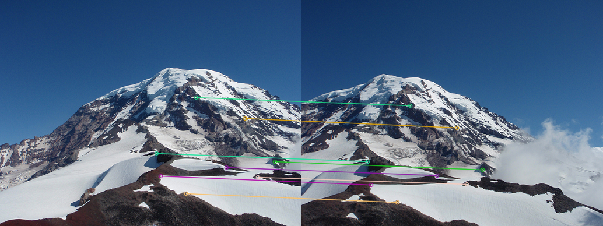
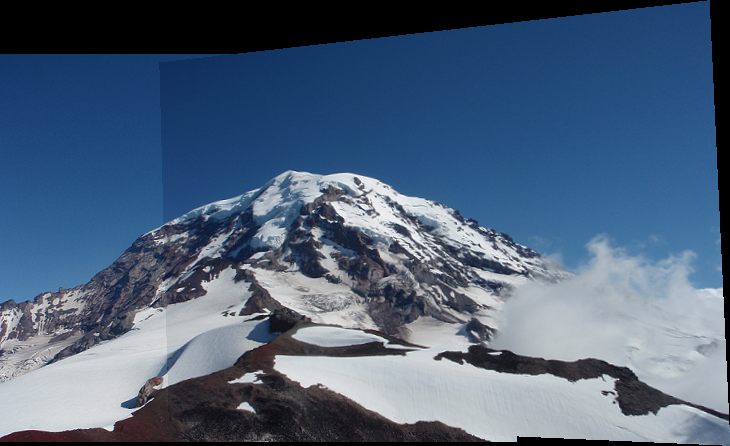
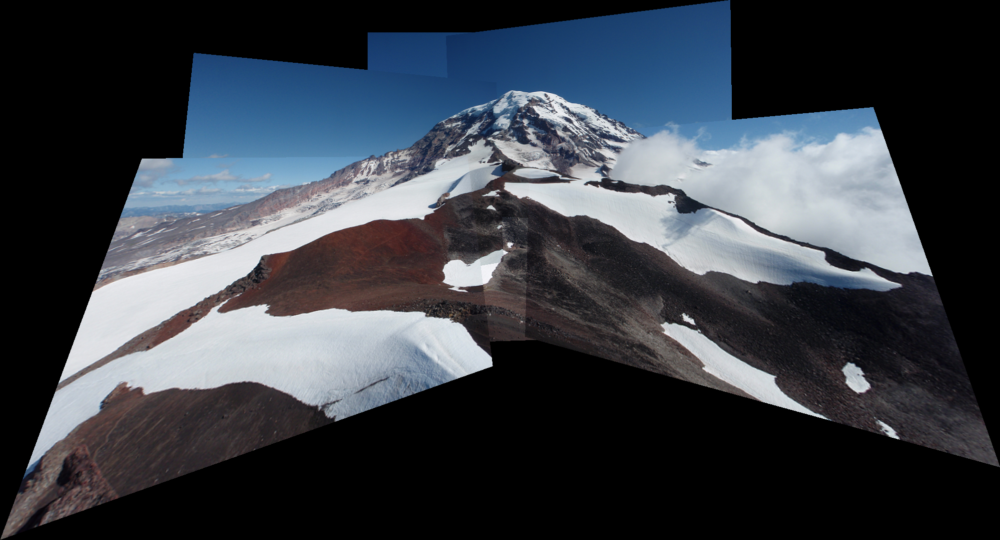
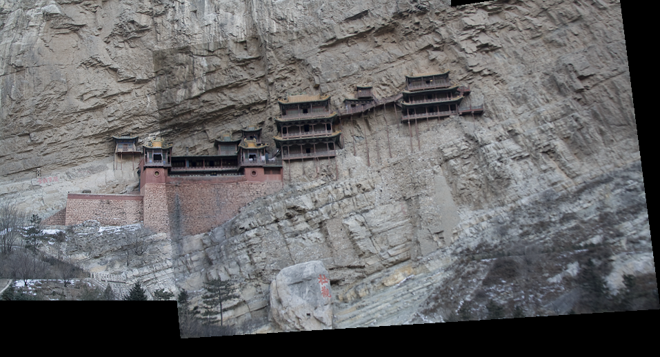
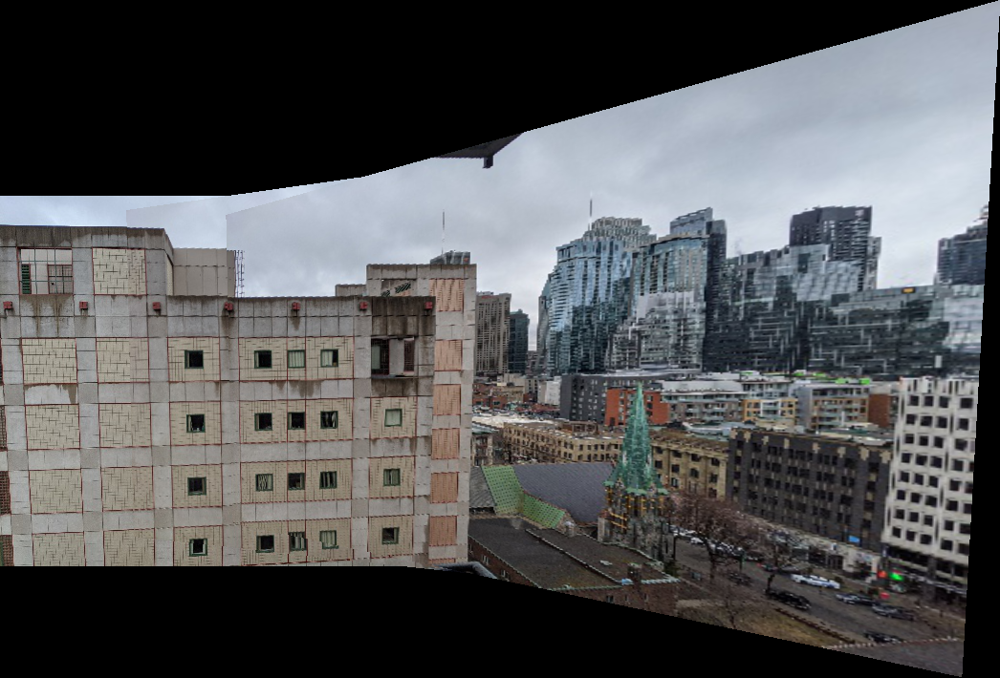

# Panoramic Image Stitching
This repository holds the code for stitching multiple images of the same scene to create panoramas. 

## Technologies
- Python
- OpenCV
- Numpy

## Method
The process followed to stitch multiple images of the scene to create Panoramas is as followes:
- Detected features/corners for the given images
  - Implemented 'Harris corner detector' to detect useful features and implemented rotation and illumination invariant SIFT descriptor to represent the corners.
  - Used OpenCV's implementation of SIFT keypoint detector and descriptor when images have variance in scale.
- Matched features across images
  - Implemented a mechanism to match features between the images using 'Sum of squared distance(SSD)'.
  - Applied 'Ratio test' to improve the matches.
- Implemented 'Random Sample Consensus(RANSAC)' to find inlier matches.
- Implemented the algorithm to 'stitch' the images based on inlier matches.
  - Found the appropriate image to stitch next, calculated the size of the new stitched image, aligned the photographs, then warped and blended the images.
  
## Results
Results for different steps implemented are as shown below. All the input image files are present in 'image_sets' directory.

###### Harris corner detector
Results of Harris corner detector on few of the images are as show below:

###### Feature matching
Results of feature matching based on the 'Harris corner detector' and rotation and illumination invariant SIFT detector are as follows:

###### RANSAC
Results of applying RANSAC algorithm on the above image to filter out inlier matches is as follows:

###### Stitching/Panorama
Results generated by aligning the matching images and further warping and blending them are as follows:

Stitching results generated using OpenCV's module for detecting SIFT keypoints and descriptors are as follows:

Refer to the 'ReadMe.pdf' file for detailed report.
